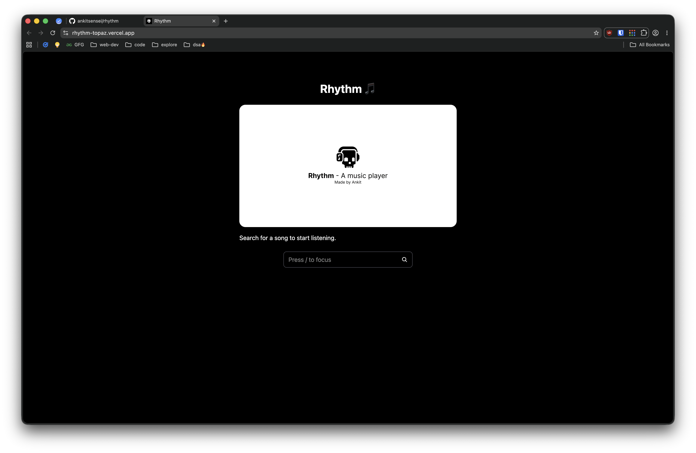
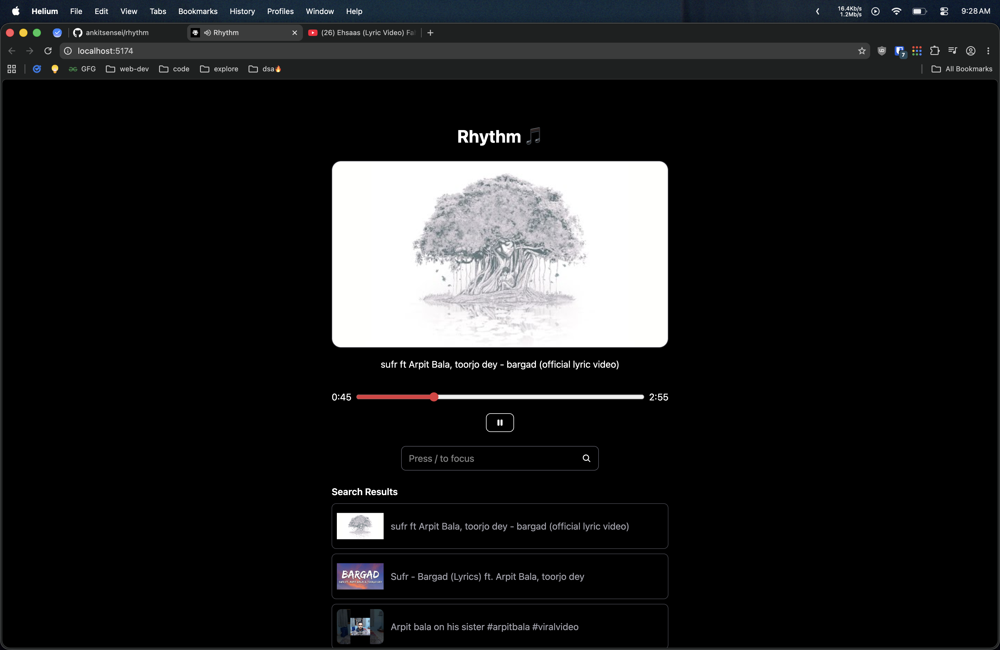
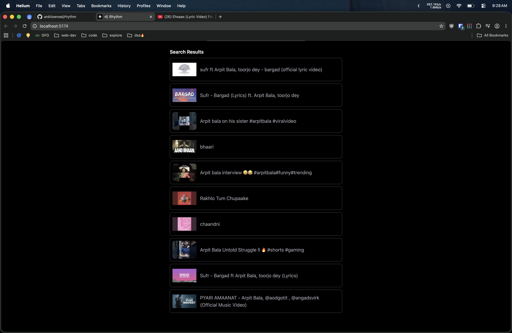

# Rhythm 🎵

<p align="center">
  
</p>

<p align="center">
  A modern music player built with React, TypeScript, Tailwind CSS, and the YouTube Data API.
</p>

<p align="center">
  Search songs, play music instantly, control playback with keyboard shortcuts, and enjoy a clean Spotify-inspired experience.
</p>

---

## 📸 Screenshots

### Home Screen



### Music Player



### Search Results



---

## ✨ Features

* 🔍 Search songs using the YouTube Data API
* 🎵 Instant music playback
* ⏯️ Play / Pause controls
* ⌨️ Keyboard shortcuts support
* 📊 Interactive progress slider
* 🖼️ High-quality thumbnails
* ⚡ Fast and responsive UI
* 📱 Mobile-friendly design

---

## ⌨️ Keyboard Shortcuts

| Key     | Action                  |
| ------- | ----------------------- |
| `/`     | Focus search bar        |
| `Enter` | Search button           |
| `Space` | Play / Pause            |

---

## 🛠️ Tech Stack

### Frontend

* React
* TypeScript
* Tailwind CSS
* React Icons
* React YouTube

### APIs

* YouTube Data API v3
* YouTube IFrame Player API

---

## 🚀 Getting Started

### Clone Repository

```bash
git clone https://github.com/ankitsensei/rhythm.git
cd rhythm
```

### Install Dependencies

```bash
npm install
```

### Environment Variables

Create a `.env` file:

```env
VITE_YOUTUBE_API_KEY=your_youtube_api_key
```

### Start Development Server

```bash
npm run dev
```

Visit:

```text
http://localhost:5173
```

---

## 📂 Project Structure

```text
src/
├── assets/
├── components/
├── App.tsx
├── main.tsx
└── index.css
```

---

## ⚠️ Disclaimer

Rhythm uses YouTube APIs for music discovery and playback.

All media content belongs to its respective copyright owners. This project does not host, store, or distribute copyrighted media.

---

## 🤝 Contributing

Contributions, issues, and feature requests are welcome.

1. Fork the repository
2. Create a feature branch
3. Commit your changes
4. Open a Pull Request

---

## 💙 Author

**Ankit Bhagat**

GitHub: https://github.com/ankitsensei

---

<p align="center">
Made with ❤️ and lots of music.
</p>
